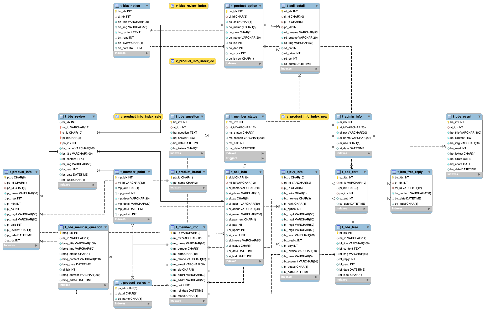

# 🛍️ JSP 쇼핑몰 사용자 페이지 구현 프로젝트

## 📌 프로젝트 개요
Java 기반 JSP/Servlet 환경에서 **쇼핑몰 사용자 구매 프로세스**를 직접 설계하고 구현한 웹 프로젝트입니다.  
상품 선택부터 장바구니, 결제, 포인트 정산, 주문 취소까지의 전체 흐름을 포함하며,  
**실제 쇼핑몰 비즈니스 로직에 가까운 기능 구현**을 목표로 하였습니다.

---

## 🛠️ 사용 기술

| 구분        | 기술 스택 |
|-------------|-----------|
| Language    | Java 1.8 |
| Web         | JSP, Servlet, JSTL, EL |
| DB          | MySQL, JDBC (수동 트랜잭션 관리) |
| Architecture | MVC (DAO, Service, Controller) |
| 기타        | Ajax, HTML, CSS, JavaScript |

---

## 🧩 담당한 주요 기능 (User Side)

### ✅ 장바구니 기능
- 동일 옵션 상품 중복 시 수량만 증가, 신규 상품은 insert
- 옵션 추가금 / 할인율 반영 가격 계산
- 장바구니 수량 수정 및 선택 삭제 기능 (Ajax 처리)

### ✅ 주문 및 결제 처리
- 장바구니 구매 / 바로 구매 분기 처리
- 주문 번호 자동 생성 (`YYMMDD + 순번`)
- 주문 정보 및 상세 상품 정보 다건 insert
- 포인트 차감 / 적립 및 상품 옵션별 재고 감소 처리
- 트랜잭션 적용 (성공 시 commit, 실패 시 rollback)

### ✅ 주문 이력 확인
- 구매한 모델명 + `"외 N개"` 요약 출력
- 주문 상태 및 결제 방식 확인 기능
- 페이징 처리된 리스트 제공

### ✅ 주문 취소 처리
- 주문 상태 '취소' 처리
- 사용 포인트 복원 및 재고 복구 포함
- 관련 테이블(`t_member_info`, `t_member_point`, `t_product_option`) 반영

---

## 🧩 데이터베이스 설계 (ERD)



쇼핑몰 전체 기능을 고려한 20개 이상의 테이블을 설계하고,  
회원/상품/주문/리뷰/장바구니/포인트 등 기능별로 정규화된 구조로 구축하였습니다.

### 📌 주요 테이블 요약

- **t_member_info**: 회원 기본 정보
- **t_product_info / t_product_option**: 상품 정보 및 색상/용량/등급 옵션, 재고 포함
- **t_sell_info / t_sell_detail**: 주문 기본 정보 및 주문 상세 항목
- **t_sell_cart**: 장바구니 테이블
- **t_member_point**: 포인트 적립/사용 내역 관리
- **t_buy_info**: 사용자의 중고폰 판매 요청 내역
- **t_admin_info**: 관리자 로그인 정보
- **t_bbs_***: 게시판 관련 테이블 (공지, 리뷰, 질문, 이벤트 등)

> 데이터 정합성과 비즈니스 흐름을 고려하여, 외래키 대신 어플리케이션 단 로직 처리 중심으로 설계함.
---

## 📷 시연 화면
> 📸 캡처 또는 GIF로 장바구니 담기 → 주문 → 결제 흐름을 설명하는 시연 이미지 삽입 가능
- ** 상품 선택 후 장바구니 담기 및 이동

---

## 🧑‍💻 담당 역할 요약
- 사용자 전체 주문 프로세스 흐름 설계 및 구현
- 직접 SQL 작성 및 join을 활용한 계산식 구현
- 트랜잭션 관리 적용으로 데이터 무결성 확보
- 장바구니 ~ 결제 ~ 취소까지 E2E 흐름 처리

---

## 📂 프로젝트 실행 방법
```bash
# MySQL DB 연동 및 초기 테이블 설정
# Tomcat 8.5 이상, JDK 1.8 이상에서 실행
